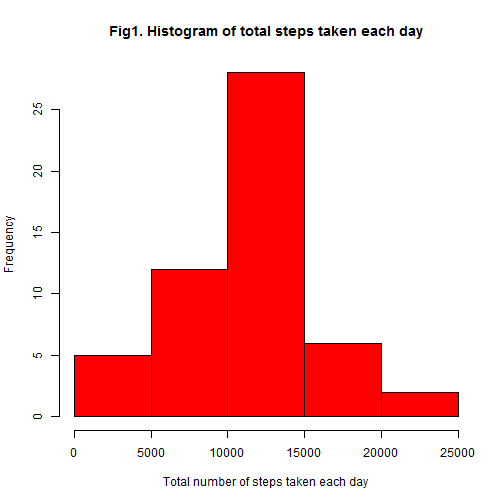
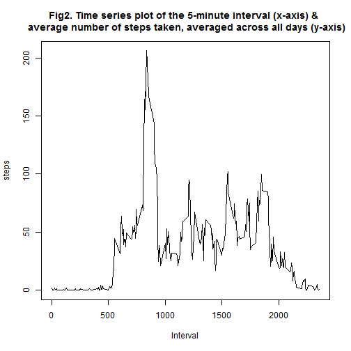
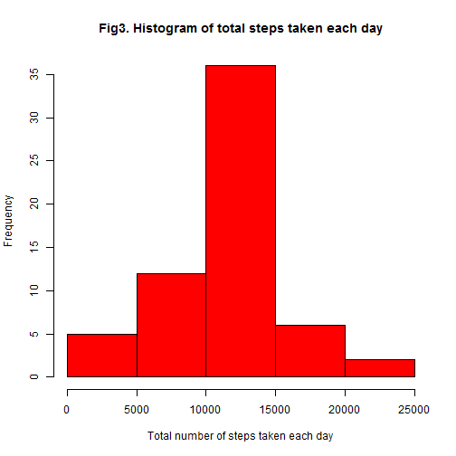
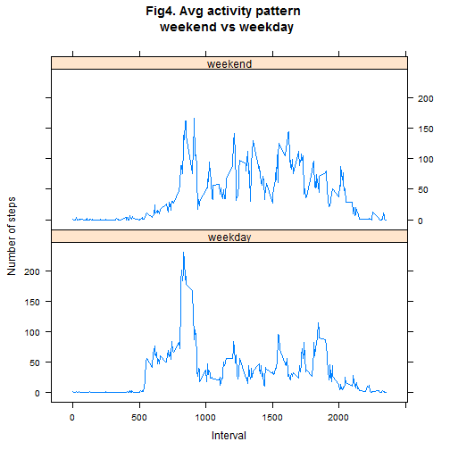

* ###  Loading and preprocessing the data

```r
setwd("C:/Rjupalli/CourseEra/2015/5-Reproducible Research/Project-1")

#1 - Loading the data
am_data <- read.csv("activity.csv", stringsAsFactors = F)

#2 - Processing the data - converting "date"(character string) into "Date" format
am_data$date <- as.Date(am_data$date, format = "%Y-%m-%d")
```
<br>  

* ### Calculating mean total number of steps taken per day

```r
#1 - Total number of steps taken per day
ttlsteps_per_day <- aggregate(. ~ date, data=am_data,FUN = sum)
```

Total number of steps taken per day (excluding days with "NA" data):

```
##          date steps
## 1  2012-10-02   126
## 2  2012-10-03 11352
## 3  2012-10-04 12116
## 4  2012-10-05 13294
## 5  2012-10-06 15420
## 6  2012-10-07 11015
## 7  2012-10-09 12811
## 8  2012-10-10  9900
## 9  2012-10-11 10304
## 10 2012-10-12 17382
## 11 2012-10-13 12426
## 12 2012-10-14 15098
## 13 2012-10-15 10139
## 14 2012-10-16 15084
## 15 2012-10-17 13452
## 16 2012-10-18 10056
## 17 2012-10-19 11829
## 18 2012-10-20 10395
## 19 2012-10-21  8821
## 20 2012-10-22 13460
## 21 2012-10-23  8918
## 22 2012-10-24  8355
## 23 2012-10-25  2492
## 24 2012-10-26  6778
## 25 2012-10-27 10119
## 26 2012-10-28 11458
## 27 2012-10-29  5018
## 28 2012-10-30  9819
## 29 2012-10-31 15414
## 30 2012-11-02 10600
## 31 2012-11-03 10571
## 32 2012-11-05 10439
## 33 2012-11-06  8334
## 34 2012-11-07 12883
## 35 2012-11-08  3219
## 36 2012-11-11 12608
## 37 2012-11-12 10765
## 38 2012-11-13  7336
## 39 2012-11-15    41
## 40 2012-11-16  5441
## 41 2012-11-17 14339
## 42 2012-11-18 15110
## 43 2012-11-19  8841
## 44 2012-11-20  4472
## 45 2012-11-21 12787
## 46 2012-11-22 20427
## 47 2012-11-23 21194
## 48 2012-11-24 14478
## 49 2012-11-25 11834
## 50 2012-11-26 11162
## 51 2012-11-27 13646
## 52 2012-11-28 10183
## 53 2012-11-29  7047
```

 


```r
#3 - Mean and median of the total number of steps taken per day
mean_ttlsteps_per_day <- mean(ttlsteps_per_day$steps)
```
Mean of the total number of steps taken per day(excluding days with "NA" data):
**1.0766189 &times; 10<sup>4</sup>**
<br>

```r
median_ttlsteps_per_day <- median(ttlsteps_per_day$steps)
```
Median of the total number of steps taken per day(excluding days with "NA" data): **10765**
<br>
<br>

* ### Visulaizing average daily activity pattern

```r
mean_ttlsteps_per_interval <- aggregate(. ~ interval, data=am_data,mean)
mean_ttlsteps_per_interval$steps <- round(mean_ttlsteps_per_interval$steps, digits = 4)
```

 

5-minute interval containing the maximum number of steps, on average across all the days in the dataset is **835**


```
##     interval    steps
## 104      835 206.1698
```
<br>

* ### Imputing missing values
Total number of missing values in the dataset (i.e. the total number of rows with NAs) is **2304**


```r
#Creating a new dataset, same as the original dataset but with the missing data filled in.
am_data_no_NAs <- am_data
am_data_no_NAs$steps <- ifelse(is.na(am_data$steps) == TRUE, mean_ttlsteps_per_interval$steps[mean_ttlsteps_per_interval$interval %in% am_data_no_NAs$interval], am_data_no_NAs$steps)
ttlsteps_no_NAs <- aggregate(. ~ date, data=am_data_no_NAs,FUN = sum)
```

 
<br>


```r
#Calculate and report the mean total number of steps taken per day
mean_ttlsteps_per_day_no_NAs <- mean(ttlsteps_no_NAs$steps)
```
Mean total number of steps taken per day (with "NA" replaced by the interval mean values): **1.0766189 &times; 10<sup>4</sup>**
<br>


```r
#Calculate and report the median total number of steps taken per day
median_ttlsteps_per_day_no_NAs <- median(ttlsteps_no_NAs$steps)
```
Median total number of steps taken per day (with "NA" replaced by the interval mean values):
**1.0766189 &times; 10<sup>4</sup>**
<br>

* Do these values differ from the estimates from the first part of the assignment? What is the impact of imputing missing data on the estimates of the total daily number of steps?
<br>

**They do not. With only about more than 15% of the values being "NA"s and with the "NA" values only in 8 out of 61 days, combined with the fact that missing values imputed by thier corresponding interval means, impact of imputing missing data is negligible. However, with missing values imputed by thier corresponding interval means, both mean and median match. **
<br>
<br>

* ### Difference in activity patterns between weekdays and weekends?

```r
#1 - Create a new factor variable in the dataset with two levels - "weekday" and "weekend" indicating whether a given date is a weekday or weekend day.

am_data_with_days <- am_data_no_NAs
am_data_with_days[, "day"] <- weekdays(as.Date(am_data_with_days$date))
am_data_with_days$day <- ifelse(am_data_with_days$day %in% c("Saturday", "Sunday"), "weekend","weekday")
am_data_with_days$day <- as.factor(am_data_with_days$day)

mean_steps_per_interval_per_day <-aggregate(steps ~ interval + day, data=am_data_with_days,mean)
```

 

* Are there differences in activity patterns between weekdays and weekends?
<br>
**Yes. There are. On average the anonymous individaul from whom this data is collected seems to move more on weekends than weekdays during the two months data is provided. On weekend, the individual seems to move more from the morning to the evening where as on weekdays, the activity seems to more centered around the morning and small peaks during lunch time and evening. **
